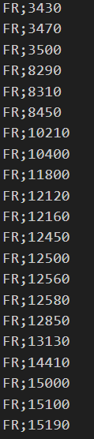

# PROGRAM DESCRIPTION

This is a python script that automatically finds the ISO3166 (or ISO Region Code) from a ZIP Code and a Country code. It uses OpenStreetMap Nominatim and GeoNames databases.

# HOW TO USE

1. Clone this repo on your computer.
2. Prepare a .csv file with your data as it's done in the `example.csv` and the image below.
3. Run the python program and specify the path (or name if in the same folder) to your input and output files.
4. Let the programme run, as the APIs used have a min delay between every request I added a 1.1 sec cooldown for every line. So the program can take some times to process big files.



# DEPENDENCIES

To run this script you will need Python 3 and the following librairies installed on your computer:
```
geopy
pgeocode
sys
csv
time
```
# LICENSING
This project is licensed under the [GNU General Public License v3.0](https://www.gnu.org/licenses/gpl-3.0.en.html). 

If you use **ANY** code from the source:
- You must disclose the source code of your modified work and the source code you took from this project. This means you are not allowed to use code from this project (even partially) in a closed-source and/or obfuscated application.
- You must state clearly and obviously to all end users that you are using code from this project.
- Your application must also be licensed under the same license.

# DISCLAIMER
This project uses free APIs that are not 100% accurate so it's possible that some of the results provided are not correct or that some ISO3166 doesn't get found. 
If you're looking for a very accurate result i recommend paying for some APIs like the google map one.
